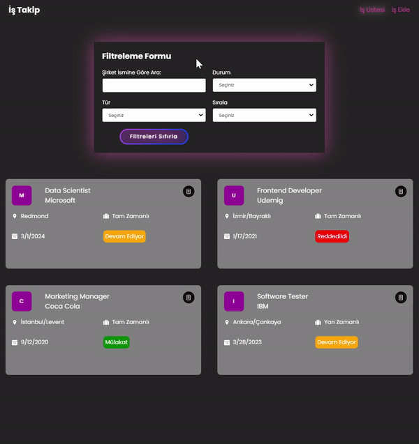

<h1> Job App Toolkit</h1>
Bu proje iş başvurularını takip etmek için geliştirilmiş bir web uygulamasıdır. Kullanıcılar iş başvurularını listeleme, ekleme, güncelleme ve silme gibi temel işlemleri gerçekleştirebilirler.

<h2>Proje Özellikler </h2>
<ul>
<li>Farklı iş pozisyonları için yapılan başvurular sisteme eklenebilir.</li>
<li>Her bir iş başvurusu için pozisyon adı, şirket adı, konum, başvuru durumu, iş türü ve başvuru tarihi gibi önemli bilgiler girilebilir.</li>
<li>Başvurularını istenilen kriterlere göre filtrelenebilir. Örneğin başvuru durumu, iş türü veya şirket adı gibi.</li>
<li>Başvurular istenilen şekilde sıralanabilir. Örneğin alfabetik olarak şirket adına göre veya başvuru tarihine göre.</li>
<li>Eklenilen başvurular güncellenebilir veya silinebilir.</li>
<li>Yeni bir iş başvurusu eklendiğinde otomatik olarak bir ID ve tarih atanır.</li>
<li>Uygulamanın kullanıcı dostu arayüzü sayesinde başvurular kolayca yönetilebilir.</li>
<li>Hatalı bir işlem gerçekleştirildiğinde bilgilendirilir ve uygulamanın sağlaması sayesinde güvenli bir şekilde işlem yapılır.</li>

</ul>

<h2>Proje Bileşenleri </h2>
<li> Header:
<ul>
<li>Uygulamanın üst kısmında yer alır ve farklı sayfalar arasında gezinmeyi sağlar.</li>
</ul>
</li>
 
<li>JobList:
<ul>
<li>Kullanıcının iş başvurularını listeleyen ana bileşendir.</li>
<li>Redux store'dan iş verilerini alır ve gerekirse filtreler veya sıralar.</li>
</ul>
</li>
 
<li>AddJob:
<ul>
<li>Yeni iş başvurusu eklemek için kullanılan bileşendir. </li>
<li>Kullanıcıdan gerekli bilgileri alır ve bu bilgileri Redux store'a ekler. </li>
</ul>
</li>
<li>Filter:
<ul>
<li>İş başvurularını filtrelemek için kullanılan bileşendir. </li>
<li>Kullanıcıya durum, tür veya diğer özelliklere göre filtreleme yapma imkanı sunar. </li>
</ul>
</li>
</ul>

<h2> Veri Yapısı</h2>

Projede kullanılan iş başvuru verisi, JSON formatında sağlanmıştır. Her bir iş başvurusu, "id", "position", "company", "location", "status", "type" ve "date" gibi özelliklere sahiptir.

<h2> Proje Amaci</h2>

React, Redux Toolkit gibi güçlü bir araç kiti kullanarak  temel bileşenlerin nasıl oluşturulacağını, verilerin nasıl yönetileceğini ve kullanıcı etkileşimlerinin nasıl işleneceğini daha iyi anlamayı amaçlamaktadır.'

<h2>Kullanılan Teknolojiler </h2>
<ul>
<li>React-Router-Dom</li>
<li>Axios</li>
<li>Sass</li>
<li>ReactToastify</li>
<li>Json-Server</li>
<li>React-Redux</li>
<li>@reduxjs/toolkit</li>
<li>Uuid</li>
<li>React-Icons</li>
</ul

<h2>Ekran Görüntüsü</h2>

